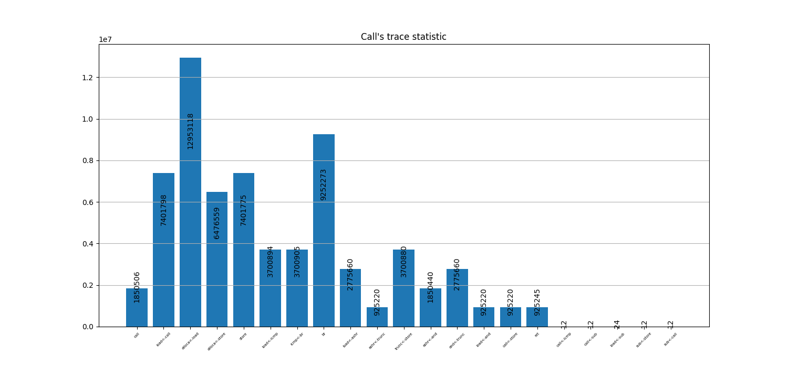

# Usage

## Run pass

```shell
cd ../task_1/build
clang++ ../../task_2/loggerTracePath.cpp -fPIC -shared -I$(llvm-config --includedir) -o libPass.so
clang++ -fpass-plugin=./libPass.so -c ../src/main.cpp $(sdl2-config --cflags)
clang -c ../src/sdl.cpp $(sdl2-config --cflags)
clang -c ../../task_2/log.c
clang++ *.o $(sdl2-config --cflags --libs)
```

## Show statistic
```shell
./a.out > trace.log
cp trace.log ../task_2 && cd ../task_2
python graph.py
```

